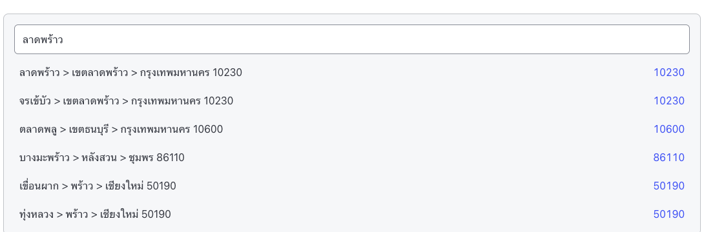
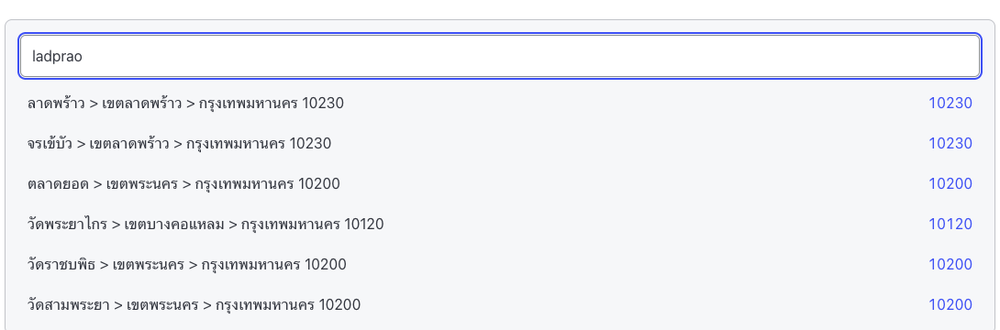

# thaizip

[](https://www.npmjs.com/package/thaizip)
[](https://www.npmjs.com/package/thaizip)
[](https://github.com/naay99999/thai-zip/blob/main/LICENSE)

Fast fuzzy autocomplete for Thai addresses — subdistrict, district, province, postal code. Thai and English input, zero runtime dependencies, React optional.

**Docs:** https://naay99999.github.io/thai-zip/ (ไทย / [English](https://naay99999.github.io/thai-zip/en/))

| Thai input | English input (romanization alias) |
|---|---|
|  |  |

```bash
npm install thaizip
```

| import path | contents |
|---|---|
| `thaizip` | core functions + types (no React code, 4.4 KB gzip) |
| `thaizip/react` | `useThaiAddressAutocomplete` (ships `"use client"`) |
| `thaizip/data` | `loadDefaultIndex`, `clearDefaultIndex` (132 KB gzip) |

## Quick start

```ts
import { loadDefaultIndex } from 'thaizip/data'
import { searchThaiAddress, formatThaiAddressSuggestion, resolveThaiAddress } from 'thaizip'

const index = await loadDefaultIndex() // ~40ms of synchronous work, cached after

searchThaiAddress(index, 'ลาดพร้าว')
searchThaiAddress(index, 'bang rak')
searchThaiAddress(index, '10500')

formatThaiAddressSuggestion(record)                  // for the dropdown
formatThaiAddressSuggestion(record, { locale: 'en' })
resolveThaiAddress(record)                           // for saving
```

Call `loadDefaultIndex()` at mount or route load — deferring it to the user's first keystroke costs ~2 dropped frames.

## Search

```ts
searchThaiAddress(index, query, {
  limit: 10,                 // text queries only
  threshold: 0.4,            // match quality 0–1
  zipLimit: Infinity,        // all-digit queries — unlimited by default
  romanizationAliases: true, // expand non-RTGS spellings
})
```

Results rank by trigram score, then by how well the query matches the subdistrict's **own** name (exact → prefix → substring), then alphabetically. That second key is what keeps ตำบลลาดพร้าว above the other subdistricts that merely sit inside เขตลาดพร้าว.

> Combined text + zip in one query (`"ลาดพร้าว 10900"`) is not supported — search by name or zip separately.

### Postal codes

One Thai postal code can cover many subdistricts — `45000` covers 33, and 230 of the 953 codes cover more than 10 — so `zipLimit` defaults to unlimited rather than silently truncating at `limit`.

```ts
import { lookupByZipCode } from 'thaizip'

lookupByZipCode(index, '45000') // exact
lookupByZipCode(index, '450')   // prefix
```

### English input

The dataset indexes official RTGS spellings, so `bang rak` and `chatuchak` work directly. 87 common non-RTGS spellings are mapped on first: `lardprao` → `lat phrao`, `ladkrabang` → `lat krabang`, `krungthep` → `bangkok`. It is a curated dictionary, not a transliterator — unlisted spellings still miss. Opt out with `romanizationAliases: false`.

### Cascade dropdowns

```ts
import { listProvinces, listAmphures, listTambons } from 'thaizip'

listProvinces(index)            // 77, sorted by Thai name
listAmphures(index, provinceId)
listTambons(index, amphureId)   // each with its zipCode
```

Backed by pre-built groupings, not scans over all 7,385 records. Unknown ids return `[]`.

## React

```tsx
import { useThaiAddressAutocomplete } from 'thaizip/react'

const { query, setQuery, setQuerySilent, suggestions, isOpen, selectSuggestion, clear } =
  useThaiAddressAutocomplete({ index })
```

Options: `index`, `limit`, `debounce` (200ms), `threshold`, `zipLimit`, `locale`, `initialQuery`, `onSelect`.

| value | description |
|---|---|
| `query` / `setQuery` | input value; `setQuery` searches |
| `setQuerySilent` | set the value **without** searching or reopening the dropdown |
| `suggestions` | `ThaiAddressSuggestion[]` |
| `isOpen` | `query` is non-empty and suggestions exist |
| `selectSuggestion` | `(item) => ResolvedThaiAddress \| null` — clears suggestions, leaves `query` alone; `null` if the item is stale |
| `clear` | reset query and suggestions |

### Controlled forms

`selectSuggestion` leaves `query` untouched by design. To echo the choice back into the input use `setQuerySilent` — plain `setQuery` would immediately reopen the dropdown:

```tsx
const handlePick = (s: ThaiAddressSuggestion) => {
  const address = selectSuggestion(s)
  if (!address) return
  setQuerySilent(s.label)
  form.setValue('address', address)
}
```

Editing a saved address? Pass `initialQuery` rather than calling `setQuery` in an effect.

### Accessibility

The hook owns query and suggestion state only. Keyboard navigation and ARIA combobox semantics are yours — `npx react-thaizip add autocomplete` scaffolds a component that already has them.

## Custom data

```ts
import { buildThaiAddressIndex, validateRawData } from 'thaizip'

const index = buildThaiAddressIndex({ provinces, amphures, tambons }, {
  onSkip: (tambon) => console.warn('skipped:', tambon.id),
  validate: true, // default
})
```

Input is validated by default, so a stray non-string field fails with `[thaizip] tambon 100404: expected string for name_th, got number` instead of crashing inside the normalizer. It costs nothing measurable on a full-size dataset. `validateRawData(data)` runs the same checks standalone.

`RawData` is meant to be trusted, application-controlled input — your own dataset, not arbitrary end-user uploads. `buildThaiAddressIndex` has no built-in cap on row count or field length; build cost scales linearly with total input size, but an unbounded or maliciously oversized payload (e.g. an admin importer fed directly to this function) can still cost real time and memory with nothing to stop it. If you ever build an index from untrusted input, enforce your own size limits (row count, field length) before calling `buildThaiAddressIndex`.

Types: `RawData`, `RawProvince`, `RawAmphure`, `RawTambon`.

## Types

```ts
type ThaiAddressSuggestion = {
  id: string
  label: string      // follows `locale`, Thai by default
  labelTh: string
  labelEn: string
  tambon: string;    tambonEn: string
  amphure: string;   amphureEn: string
  province: string;  provinceEn: string
  zipCode: string
}

type ResolvedThaiAddress = {
  tambon: string;    tambonEn: string     // alias: subdistrict / subdistrictEn
  amphure: string;   amphureEn: string    // alias: district / districtEn
  province: string;  provinceEn: string
  zipCode: string                         // alias: postalCode
  subdistrict: string; subdistrictEn: string
  district: string;    districtEn: string
  postalCode: string
}
```

## Data

77 provinces, 918 districts, 7,385 subdistricts. Records whose parent district or province is soft-deleted are excluded automatically.

`searchThaiAddress` is pure and framework-free — it works unchanged in Node, Vue, Svelte, or vanilla JS.

## License

MIT
